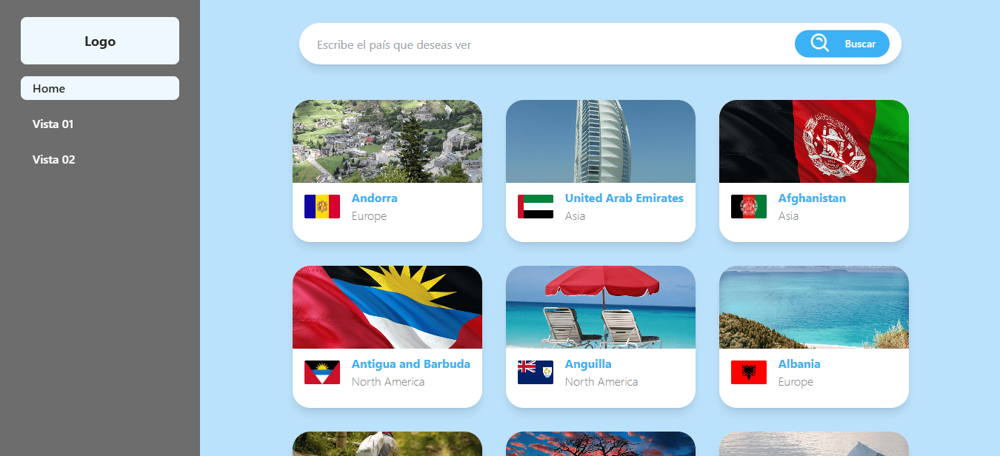

# 🌍 GeoExplorer

### Descripción

**GeoExplorer** es una aplicación web interactiva que permite explorar información detallada sobre continentes y países del mundo. Utiliza múltiples APIs para ofrecer datos precisos, banderas oficiales e imágenes representativas. Desarrollada como reto técnico para una empresa de desarrollo de software, está construida con tecnologías modernas y un diseño responsive.

## 📸 Preview del Proyecto



---

### ✨ Características Principales

- ✅ **Búsqueda Interactiva**: Consulta información sobre países con autocompletado.
- ✅ **Diseño Responsivo**: Optimizado para móviles, tablets y escritorios.
- ✅ **Integración de APIs**: Datos en tiempo real y visuales atractivos.
- ✅ **Dark Mode**: Adaptación automática al sistema del usuario.

---

### 🛠️ Tecnologías Utilizadas

- 
- 
- 
- 
- 
- 

---

### 🌐 APIs Utilizadas

| Función         | API                                                                   |
| --------------- | --------------------------------------------------------------------- |
| Datos de países | [Trevor Blades Countries API](https://countries.trevorblades.com/)    |
| Banderas        | [Banderas del Mundo API](https://www.banderas-mundo.es/descargar/api) |
| Imágenes        | [Pixabay API](https://pixabay.com/api/docs/)                          |

---

### 🎯 Funcionalidades

- 🌎 **Explorar Continentes y Países**: Accede a datos organizados por regiones.
- 🏳️ **Visualización de Banderas**: Bandera oficial de cada país en alta calidad.
- 🗺️ **Imágenes Representativas**: Fotos relacionadas a cada país o región.
- 🧭 **Filtrado Dinámico**: Interacción rápida e intuitiva.

---

### 🚀 Instalación y Uso

⭣ 1. Clona el repositorio

```console
git clone https://github.com/kevinmadrid-dev/geoexplorer.git
```

⭣ 2. Ingresa a la carpeta del proyecto

```console
cd geoexplorer
```

⭣ 3. Instala las dependencias

```console
npm install
```

⭣ 4. Ejecuta el servidor de desarrollo

```console
npm run dev
```

### Contacto

- GitHub: [kevinmadrid-dev](https://github.com/kevinmadrid-dev)
- LinkedIn: [kevinmadrid-dev](https://www.linkedin.com/in/kevinmadrid-dev/)

⭐ Si te gusta este proyecto, ¡dale una estrella en GitHub!
